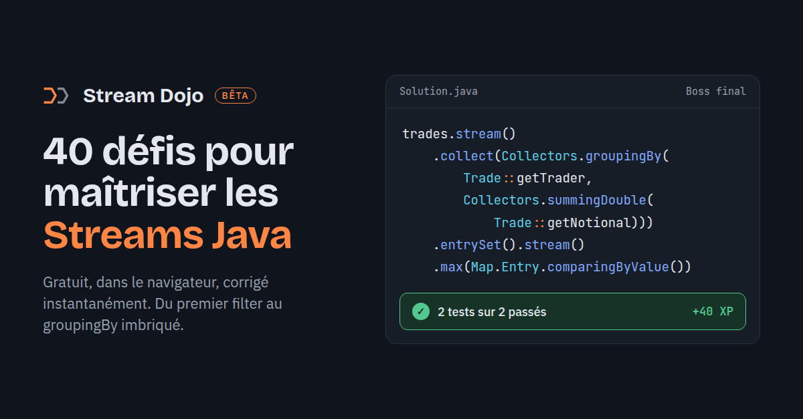

# Stream Dojo

**40 défis pour maîtriser les Streams Java, directement dans le navigateur.**

👉 [Essayer Stream Dojo](https://mathbruu.github.io/stream-dojo/)

## Le principe

Un énoncé, tu écris ton stream, c'est corrigé tout de suite. Et tu enchaînes.

- **40 défis en 8 chapitres**, du premier `filter` au `groupingBy` imbriqué
- **Correction immédiate** sur les données affichées, puis sur un jeu de test caché
- **Erreurs expliquées** : `sum() n'existe pas sur un Stream<T>. Passe d'abord par mapToInt(...)`
- **Autocomplétion façon IDE** et suggestions en cas de faute de frappe
- **Indices, XP et progression** sauvegardée dans ton navigateur
- **Données réalistes** : des trades et des employés plutôt que des listes de fruits
- **Bac à sable** pour tester librement tes propres requêtes

Rien à installer, pas de compte. Ça marche aussi sur téléphone.

## Les chapitres

| # | Chapitre | Notions |
|---|---|---|
| 1 | Échauffement | `filter`, `map`, `toList`, `count` |
| 2 | Tri & découpe | `sorted`, `Comparator`, `limit`, `skip`, `distinct` |
| 3 | Réductions | `mapToInt`, `sum`, `average`, `max`, `reduce`, `Optional` |
| 4 | Match & find | `anyMatch`, `allMatch`, `noneMatch`, `findFirst` |
| 5 | Collectors | `joining`, `toSet`, `toMap` |
| 6 | groupingBy | `groupingBy`, `counting`, `mapping`, `partitioningBy` |
| 7 | flatMap & IntStream | `flatMap`, `Arrays.stream`, `rangeClosed`, `boxed` |
| 8 | Boss final | tout combiner |

## Comment ça marche

Le code que tu écris est exécuté par un simulateur Java écrit en JavaScript, qui tourne entièrement dans ton navigateur. C'est pour ça que la correction est instantanée.

Toutes les solutions ont été vérifiées avec le vrai JDK 21. Ce n'est pas une JVM pour autant : le simulateur est un peu plus permissif que `javac` sur les types. Si tu trouves un écart avec le comportement de Java, ouvre une issue.

Le projet a été conçu et testé par moi, avec l'aide de Claude (IA) pour une grande partie du code.

## Ton avis

C'est une bêta. Un exercice pas clair, un bug, une idée de chapitre ? Ouvre une issue ou écris-moi sur [LinkedIn](https://www.linkedin.com/in/mathisbruyere/).

---

Réalisé par [Mathis](https://www.linkedin.com/in/mathisbruyere/).
